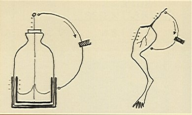
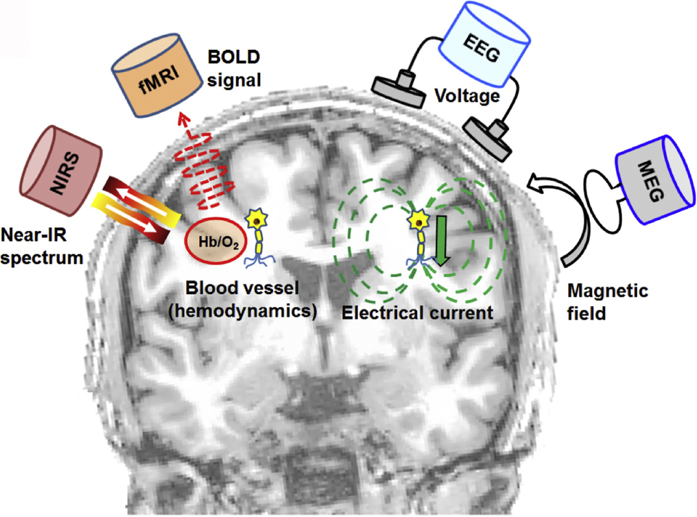
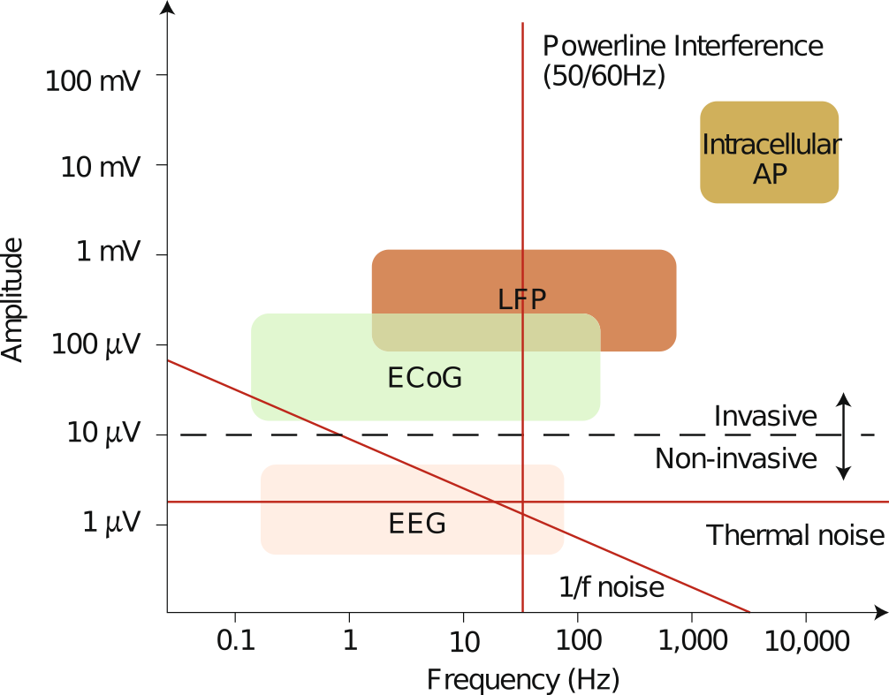
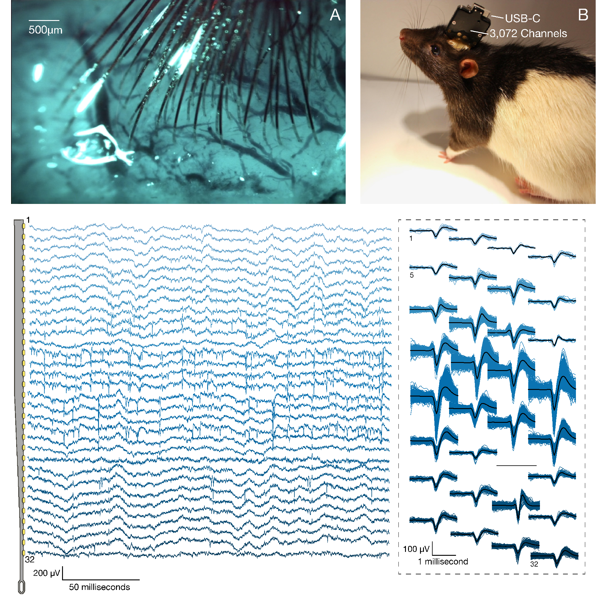
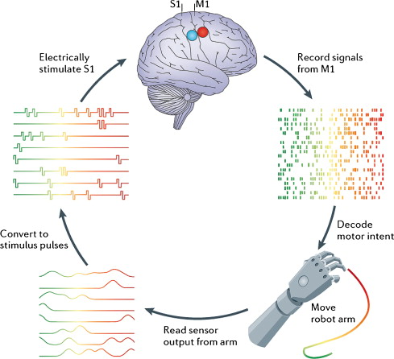

```{r setup, include=T, echo=FALSE}
knitr::opts_chunk$set(echo=FALSE, warning=FALSE, message=FALSE, kfigr.prefix=TRUE, kfigr.link=TRUE, comment=NA)
library(qrcode)
```

## Before starting

This presentation is optimized for Google Chrome and it can be found at

<center>
https://jundurraga.github.io/INST_2020/#/
</center>

<center>
```{r qr_code, eval=T, echo=F, fig.cap="", fig.width=6, fig.height=2.5}
qrcode_gen('https://jundurraga.github.io/INST_2020/#/')
```
</center>


A printable version of this presentation can be obtained at

<center>
https://jundurraga.github.io/INST_2020/?print-pdf#/
</center>


# Introduction

## Neural interfaces

- Advancements in electronics able to interfacing with the nervous system is a rapidly advancing.
The implications of these technologies reach basic sciences and medical applications.

- Furthermore, neural interfaces can provide a direct, electrical bridge between the nervous systems and machines with the potential of transferring of information in one or both directions.


<center>
{width="80%"}
</center>

<center>
From @chaudharyBrainComputerInterfaces2016
</center>

## History

- 1791 "De viribus electricitatis in motu muscolari. Commentarius" Galvani applied charges to the nerves of dead frogs’ muscles and observed contractions.

<center>
{width="20%"}
<center>

- 1949 voltage clamp technology -> Hodgkin and Huxley to record currents carried by sodium and potassium ions through nerve cell membranes using electrochemical gradients.

- 1952 @hodgkinQuantitativeDescriptionMembrane1952 model mathematically describes the membrane potentials using a resistor–capacitor (RC) circuit model

- 1957 André Djourno and Charles Eyriès original cochlear implant

- 1961 William House cochlear first implants 

- 1978 First multiple channel CI was implanted into deaf volunteer

- 1991 [Utah](https://www.blackrockmicro.com/electrode-types/utah-array/) electrode array


- 1997 Deep brain stimulation for Parkinson’s Disease

- 2002 first retinal implant; closed-loop brain machine interfacing in monkeys

- 2009 [BrainGate2](https://www.braingate.org): brain implant system built designed to help those affected by neurologic disease or injury.

- 2013 Responsive Neurostimulation (RNS) for epilepsy [@thomasCriticalReviewResponsive2015].

- 2019 [Neuralink](https://www.neuralink.com/) 3,072 electrode array [@muskIntegratedBrainmachineInterface2019]


## Hodgkin and Huxley Model

<div class='multiCol'>
<div class='col'>

<center>
$C_{m}\frac{dV}{dt} = I_{Na} +  I_{K} + I_{leak} + I_{syn}$
</center>

<center>
$I_{Na} = \bar{g}_{Na} m^3 h \left(E_{Na} - V\right)$
</center>

<center>
$I_{K} = \bar{g}_{K} n^4 \left(E_{K} - V\right)$
</center>

<center>
$I_{leak} = \bar{g}_{leak} \left(E_{leak} - V\right)$
</center>

<center>
$I_{syn} = \sum_{i=1}^{n_{syn}} g_{syn_i} V$
</center>

</div>
<div class='col'>
<video src="./my_figures/41592_2020_762_MOESM5_ESM.mp4" type="video/mp4" controls height="200" width="600" preload="auto">
</video>

</div>
</div>


<center>
{width="100%"}
<center>

The Hodgkin-Huxley model is the central pillar of modern neuroscience research.
It implications range from molecular investigations of the structural basis of ionic channels to the basis of neural interfacing with technology. 

## Hodgkin and Huxley simulator 

**[Try this simulator](http://myselph.de/hodgkinHuxley.html)**. Set random current (IRand) to zero, current injection stop-time (tInjStop) to 50, current amplitude (IDC) to 10  and  **investigate what is the effect on the neuron's threshold and spike morphology when changing**

- pulse parameters:  duration, amplitude 
- maximum conductances: sodium (GNaMax), potassium (GKMax), leak (Gm)
- reversal potentials: sodium (ENa) ,potassium (EK)

<iframe width="800" height="600" marginheight="0" marginwidth="0" src="http://myselph.de/hodgkinHuxley.html" data-preview-link="true">
</iframe>


# Non-invasive Neural Interfaces

## Recording

A neural interface builds a bidirectional communication channel between a subject’s nervous system and a man-made device
Non-invasive methods measure the compound extracellular activity of hundreds of thousands.


<div class='multiCol'>
<div class='col'>
{width="100%"}
</div>
<div class='col'>

**Indirect**: 

Blood oxygen level dependent response (BOLD): a proxy measure of neural activity

- Functional magnetic resonance imaging
- Near Infrared Spectroscopy

**Direct:**

- Electroencephalogram (EEG)
- magnetoencephalography (MEG)

**Advantages** 

- no require surgery is required
- easy to upgrade

**Disadvantages**

- weak amplitude
- It may be difficult to achieve good contact between the sensor and the scalp (high impedance)
- Sensitive to endogenous contamination (movements, external noise)
- portability is an issue

</div>
</div>

## Stimulation

<div class='multiCol'>
<div class='col'>
{width="100%"}
</div>
<div class="col">
- Transcranial current stimulation (TCS)
- Transcranial magnetic stimulation (TCS)
- Transcranial focused ultrasound (TFS)
- Transcranial photobiomodulation(tPBM)

**Advantages**

- No surgery required

**Disadvantages**

- Poor spatial resolution and low control
- limited time 
- portability is an issue


Is there more? 


</div>
</div>


# Invasive Neural Interfaces 

## Several types of neural interfaces

<center>
{width="70%"}
</center>

- non-penetrating electrodes: Electrocorticography (ECoG), Flexible μECoG electrodes (spatial resolution $\le$ millimetre range)
- Penetrating electrodes
- optical electrodes


## Frequency and amplitude resolution of differentt neural interfaces

<div class='multiCol'>
<div class='col'>
{width="100%"}
</div>
<div class='col'>

**Advantages**

- High spatial and temporal resolution 
- Increased signal-to-noise ratio
- Possibility of stimulating and recording neural activity simultaneously

**Disadvantages**

- Require surgery 
- Damage of neural and vascular structures
- Risk that any head trauma may damage the device

</div>

## Stimulation 

- Biphasic stimulation is the most commonly use pulse shape
- Stimulation mode: Monopolar, biopolar, multipolar (several electrodes)

<div class='multiCol'>
<div class='col'>
{width="100%"}
{width="100%"}
</div>
<div class='col'>
<br>

- Several pulse shapes 
- Several stimulation modes
- Several parameters (pulse width, rate, amplitude, polarity)
</div>
</div>

## Recording

<div class='multiCol'>

<div class='col' style="width: 100%">
{width="100%"}
</div>

<div class='col' style="width: 20%">
<br>

**Challenges**

- large amount of data (sampling rate > 25 kHz)
- spike detection
- spike sorting (neural identification)
- real-time signal processing (on-chip neural signal processing and feature extraction;  ASIC)
- power-consumption 
- safety 
- ethical concerns (see @sobotImplantableTechnologyHistory2018, gilbertEffectsClosedLoopBrain2018)

</div>

## Closed-loop

<div class='multiCol'>
<div class='col'>
**Neural signal feature extraction**

- neural energy in specified frequency bands
- action potential spikes, 
- frequency-time transformations 
- information theory 
- neural networks

**Hardware**
- integration of stimulating and recording front-end
- electrical artifact reduction methods
- signal processing
</div>
<div class='col'>
{width="100%"}
</div>
</div>

## Applications 

<div class='multiCol'>
<div class='col'>
- treatment of neurological disorders (epilepsy, Parkinson, depression)
- restoring [hearing](https://www.youtube.com/embed/Vm0nZH9RahE)
- control of [bionic limbs](https://www.youtube.com/embed/3RUlzAsM5dM)
- restoring [somatic sense](https://www.youtube.com/embed/_Xl6rFvuR08)
- health monitor (wearable EEG devices [IMEC](https://www.imec-int.com/en/eeg))
- mind-controlled devices ([hearing aids](https://videopress.com/embed/u2U3eC3K), wheelchairs)
- speech synthesis 
</div>
<div class='col'>

<center>
**Speech synthesis example**
</center>
<center>
From @anumanchipalliSpeechSynthesisNeural2019
</center>

<video src="./my_figures/41586_2019_1119_MOESM3_ESM.mp4" type="video/mp4" controls height="300" width="600" preload="auto">

</video>

</div>
</div>


## Further reading

Some good simulators [Brian2](https://brian2.readthedocs.io/en/stable/), [NEURON](https://neuron.yale.edu/), [many others](https://compneuroweb.com/sftwr.html)
